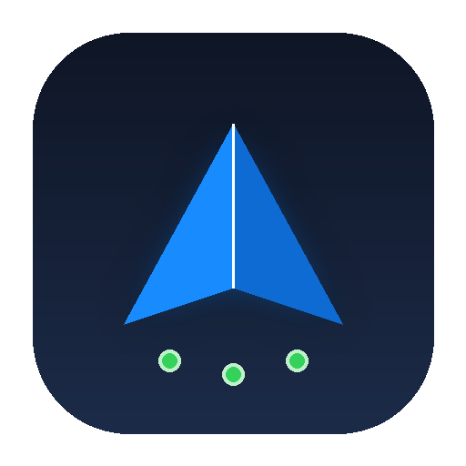

<div align="center">
  
  <h1>AeroProxy</h1>
  <p><strong>Windows 指定程序免 TUN 代理分流中枢 · 极简 Apple 风格</strong></p>
  <p>
    
    
    
    
  </p>
</div>

---

## 💡 为什么需要 AeroProxy？

### 传统痛点
* **现代应用忽略系统代理**：许多现代开发与桌面软件（如 **Antigravity**、VSCode、Slack、各类 CLI/Node.js/Go 工具）内部发起的网络请求默认**完全忽略 Windows 系统代理设置（WinINet）**，在没有全局 TUN 虚拟网卡时会直接尝试直连，导致网络超时或鉴权失败。
* **全局 TUN 模式的弊端**：
  1. **高系统开销**：创建内核虚拟网卡驱动（Wintun/TAP），全系统网络数据包在内核态与用户态频繁封包解包。
  2. **网络路由污染**：篡改全局路由表，极易造成局域网共享、局域网打印机、公司内网 VPN、本地端口（`localhost`）断连或冲突。
  3. **无法精确分流**：对系统所有程序全量接管，无法做到“仅代理我指定的软件”。

### AeroProxy 的破局之道
AeroProxy 采用**沙盒隔离环境变量 + Chromium 网络核心参数接管**机制：
* **沙盒隔离环境变量**：为选中的目标程序注入专属的 `HTTP_PROXY`、`HTTPS_PROXY`、`ALL_PROXY`，打通内部 Node.js/CLI 运行时，**严格沙盒隔离，绝不修改 Windows 全局系统变量**，其他软件完全不受影响。
* **Chromium 渲染与长连接接管**：自动追加 `--proxy-server` 与 `--proxy-bypass-list` 规则，无死角接管长连接。
* **彻底告别 TUN 虚拟网卡**：CPU 待机占用 0.0%，网络堆栈纯净，局域网与内网设备稳定如初！

---

## ✨ 功能亮点

- 🎨 **极简 Apple 风格设计**：
  - 深空黑曜石基底搭配柔和圆角（Windows 11 DWM 系统级抗锯齿圆角）。
  - 顶部导航栏内嵌一体化 **Apple 胶囊式分段切换条（分流清单 / 设置）**，大面积触控，视觉浑然一体。
  - 右上角标准极简 `—`（最小化）与 `✕`（关闭）按钮，操作顺畅自然。
  - 彻底去除模糊投影阴影，像素级清晰渲染（ClearType Display 模式）。
  - 窗口支持边缘及四角鼠标拖拽自由拉伸放大缩小。
- ⚡ **独立「设置」分页**：
  - **灵活上游代理自由配置**：支持自主修改代理 IP 与端口（支持局域网 IP），提供 5 大主流客户端快捷预设按钮（`v2rayN/Xray 10808`、`Clash 7890`、`Clash Verge 7897`、`SOCKS5 10809`、`标准 1080`）。
  - **开机自启动选项**：支持 Windows 开机自启，并可自主选择：
    - `仅自启动应用`（静默后台待命）
    - `自启动后同时自动开启代理接管`
- 🎯 **清单纯粹「只代理」模式（无需自动启动应用）**：
  - 卡片右侧提供 **`代理`** / **`未代理`** 胶囊切换按钮。
  - 仅负责为目标软件配置并接管代理环境，**不强制主动启动用户软件**，完全由用户自主掌控打开时机。
- 📂 **自主选择程序的多种途径**：
  - **醒目操作栏**：顶部直观提供 `+ 挑选程序 (.exe)` 与 `从运行中添加` 按钮。
  - **窗口级拖放（Drag & Drop）**：直接把桌面或文件夹里的任何 `.exe` 拖入窗口任意区域，松手瞬间自动加入。
  - **进程雷达**：一键列出系统当前活跃运行的窗口软件，点击快速加入。
- 🚀 **极致轻量、绿色纯净**：
  - 单文件绿色原生 EXE，体积仅约 **66 KB**。
  - 零控制台黑框（纯 Windows GUI 子系统），毫秒级秒开，待机 CPU 0.0%。

---

## 🛠️ 项目目录结构

```text
AeroProxy/
├── assets/
│   ├── icon.ico         # 嵌入式多分辨率高清程序图标
│   └── icon.png         # Logo 预览图
├── src/
│   └── Program.cs       # 纯净原生 C# 完整源代码
├── build.bat            # 一键构建脚本 (零外部环境依赖)
├── AeroProxy.exe        # 编译就绪的单文件可执行程序
├── .gitignore           # Git 忽略配置
├── LICENSE              # MIT 开源协议
└── README.md            # 项目说明文档
```

---

## 🔨 本地构建（一行命令）

本仓库使用 Windows 自带的 .NET Framework C# 编译器（`csc.exe`），无需安装 Visual Studio、无需 Node.js、无需任何额外 SDK！

克隆本仓库后，直接双击运行 **`build.bat`** 即可在 1 秒内完成编译并生成 `AeroProxy.exe`：

```cmd
git clone https://github.com/your-username/AeroProxy.git
cd AeroProxy
build.bat
```

---

## 📄 开源许可

本项目遵循 [MIT License](LICENSE) 开源协议。
